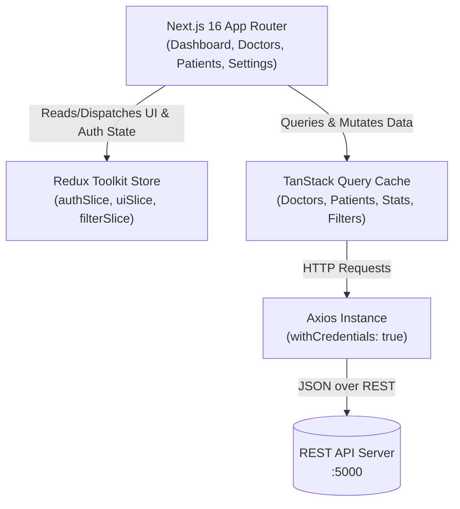

# 🩺 Doctor Tracker - Frontend Client

> Modern administrative clinical dashboard built with **Next.js 16 (App Router)**, **React 19**, **Redux Toolkit**, **TanStack React Query**, **Tailwind CSS v4**, and **Recharts**.

---

## 1. Description
**Doctor Tracker** is a high-performance clinical management web portal that allows authenticated administrators to search, filter, paginate, and manage medical practitioners and their patient rosters. The application emphasizes visual analytics, responsive usability across mobile and desktop devices, clean state management, and seamless real-time data fetching.

---

## 2. Setup Guide

### Local Installation
```bash
# 1. Install dependencies
npm install

# 2. Configure environment
cp .env.example .env.local

# 3. Start development server
npm run dev
```

The application will start at [http://localhost:3000](http://localhost:3000).

### Environment Variables (`.env.local`)
```ini
NEXT_PUBLIC_API_URL=http://localhost:5000/api/v1
```

---

## 3. System Architecture & State Flow



---

## 4. Technical Decisions

### Decision 1: Hybrid Redux Toolkit + TanStack Query over plain Context API
- **Why Redux Toolkit**: Context API triggers full component tree re-renders whenever a root state changes. Redux Toolkit provides granular selector subscriptions (`useAppSelector`) for synchronous client-side UI states (drawer open/closed, quick search modal, active filters).
- **Why TanStack Query**: Dedicated to asynchronous server state. Provides automatic background refetching, query deduplication, memory garbage collection, and `keepPreviousData` for instantaneous pagination transitions.

### Decision 2: 2-Tier Always-Visible Responsive Search & Filter Toolbar
- Instead of hidden dropdown accordions that break user flow, filters live on a dedicated responsive CSS grid (`grid-cols-2 lg:grid-cols-4` on Doctors; `grid-cols-2 sm:grid-cols-3 lg:grid-cols-5` on Patients) directly beneath a full-width search input.
- Eliminates flexbox collision bugs where inputs get squashed or clipped on smaller screens.

---

## 5. Visual Evidence

### 🖥️ Desktop Experience

#### 1. Clinical Analytics Dashboard
> Complete executive dashboard displaying real-time KPI metrics, patient volume time-series charts, doctor workload trends, and medical condition distributions.


#### 2. Doctor Directory & 2-Tier Filter Toolbar
> Comprehensive practitioner directory featuring multi-field search, specialty badges, affiliated hospitals, date filters, and action menus.


#### 3. Patient Management & Clinical Registry
> Centralized registry tracking patient demographics, active conditions, attending physicians, contact details, and visit timestamps.


#### 4. Doctor Profile & Assigned Patient Roster
> Physician profile header with credentials, hospital affiliations, direct contact channels, and dedicated assigned patient roster with inline removal.


#### 5. Administrator Settings & Infrastructure Telemetry
> Administrative profile settings, avatar management, TLS security status, and system architecture summary.


#### 6. Secure Authentication Portal
> Administrator login interface with quick credential loader, password reveal toggle, and validated form handling.


---

### 📱 Mobile Responsive Experience

| Mobile Dashboard | Mobile Doctor Directory | Mobile Patient Registry |
|:---:|:---:|:---:|
|  |  |  |
| *Executive KPI Cards* | *Card-Based Doctor Records* | *Diagnosis Badges & Records* |

| Mobile Doctor Detail | Mobile Settings & Tabs | Mobile Login Screen |
|:---:|:---:|:---:|
|  |  |  |
| *Roster Management & Actions* | *Responsive Segmented Tabs* | *Touch-Friendly Authentication* |

---

## 6. Live Deployments & Credentials

### Live Links
- **Production Dashboard**: [https://doctor-tracker-frontend-drab.vercel.app](https://doctor-tracker-frontend-drab.vercel.app)
- **Production Backend API**: [https://doctor-tracker-server-pearl.vercel.app/api/v1](https://doctor-tracker-server-pearl.vercel.app/api/v1)
- **Interactive Swagger Docs**: [https://doctor-tracker-server-pearl.vercel.app/api/docs](https://doctor-tracker-server-pearl.vercel.app/api/docs)
- **GitHub Repository**: [https://github.com/dev-abib/doctor-tracker-frontend](https://github.com/dev-abib/doctor-tracker-frontend)

### Administrator Credentials
- **Admin Email**: `admin@doctortracker.com`
- **Password**: `Admin@123456`
- *(A "Load Demo Admin Credentials" button is also provided directly on the login form)*
