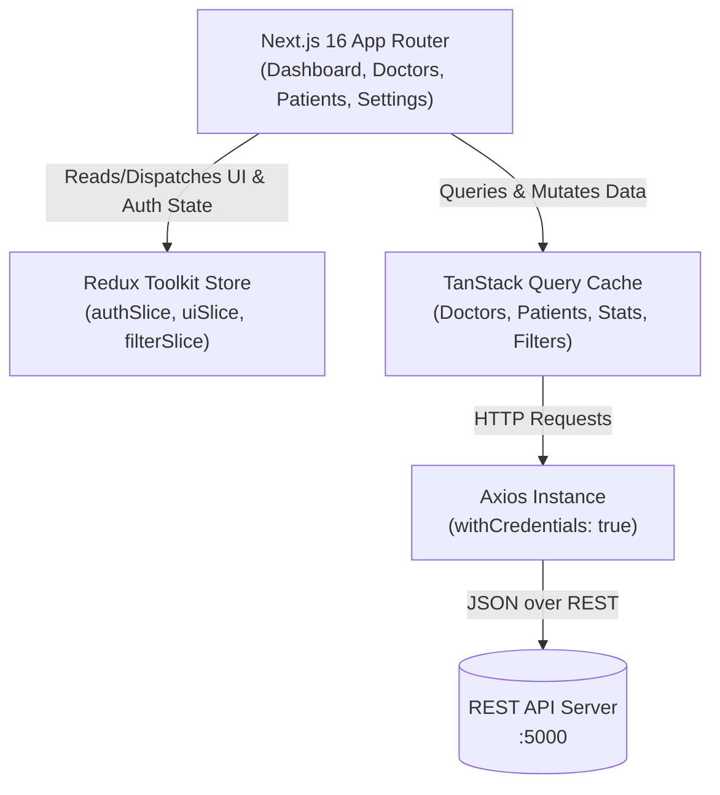

# 🩺 Doctor Tracker - Frontend Client

> Modern administrative clinical dashboard built with **Next.js 16 (App Router)**, **React 19**, **Redux Toolkit**, **TanStack React Query**, **Tailwind CSS v4**, and **Recharts**.

---

## 1. Description
**Doctor Tracker** is a high-performance clinical management web portal that allows authenticated administrators to search, filter, paginate, and manage medical practitioners and their patient rosters. The application emphasizes visual analytics, responsive usability across mobile and desktop devices, clean state management, and seamless real-time data fetching.

---

## 2. Setup Guide

### Local Installation
```bash
# 1. Install dependencies
npm install

# 2. Configure environment
cp .env.example .env.local

# 3. Start development server
npm run dev
```

The application will start at [http://localhost:3000](http://localhost:3000).

### Environment Variables (`.env.local`)
```ini
NEXT_PUBLIC_API_URL=http://localhost:5000/api/v1
```

---

## 3. System Architecture & State Flow



---

## 4. Technical Decisions

### Decision 1: Hybrid Redux Toolkit + TanStack Query over plain Context API
- **Why Redux Toolkit**: Context API triggers full component tree re-renders whenever a root state changes. Redux Toolkit provides granular selector subscriptions (`useAppSelector`) for synchronous client-side UI states (drawer open/closed, quick search modal, active filters).
- **Why TanStack Query**: Dedicated to asynchronous server state. Provides automatic background refetching, query deduplication, memory garbage collection, and `keepPreviousData` for instantaneous pagination transitions.

### Decision 2: 2-Tier Always-Visible Responsive Search & Filter Toolbar
- Instead of hidden dropdown accordions that break user flow, filters live on a dedicated responsive CSS grid (`grid-cols-2 lg:grid-cols-4` on Doctors; `grid-cols-2 sm:grid-cols-3 lg:grid-cols-5` on Patients) directly beneath a full-width search input.
- Eliminates flexbox collision bugs where inputs get squashed or clipped on smaller screens.

---

## 5. Visual Evidence
- **Desktop Dashboard**: Complete KPI cards, Bar Charts, Area Charts, and Donut Charts.
- **Desktop Doctor Directory**: Clean 2-tier search toolbar and responsive table with contact phone formatting.
- **Mobile Responsive Views**: Touch-friendly slide-over drawer and card-based responsive tables without horizontal overflow.

---

## 6. Credentials
- **Admin Email**: `admin@doctortracker.com`
- **Password**: `admin123456`
